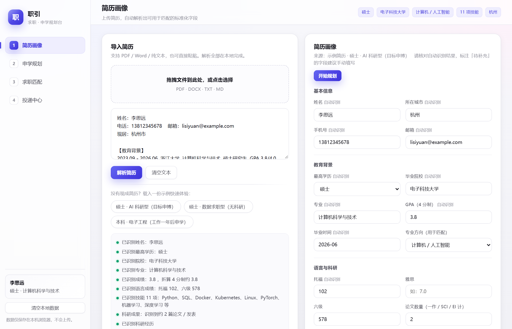
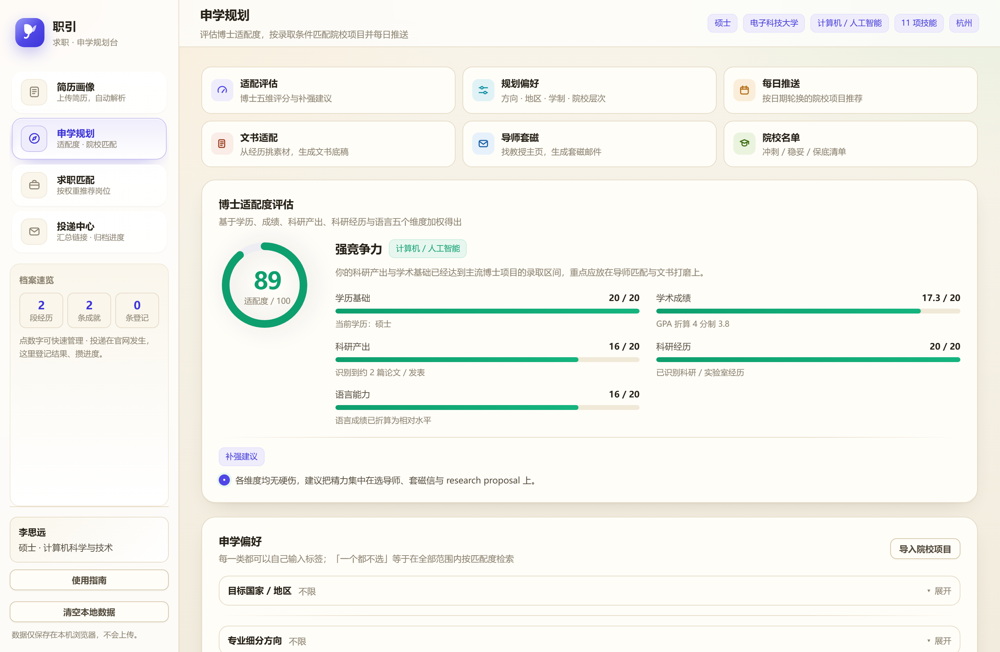
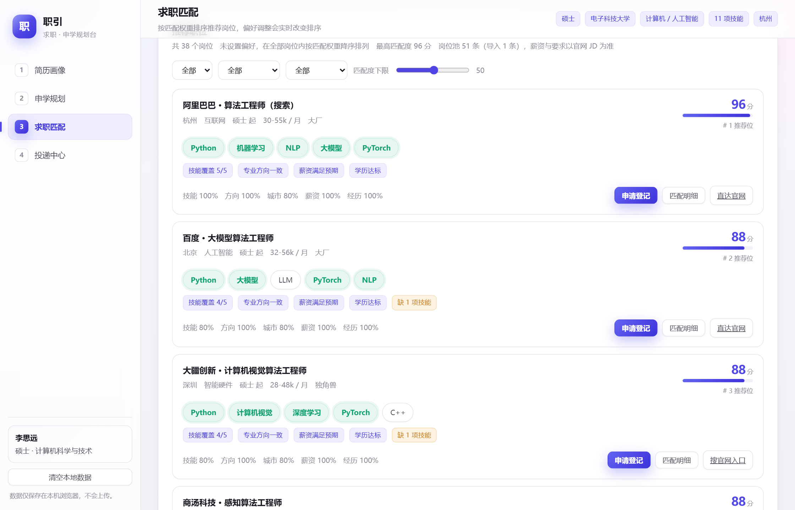
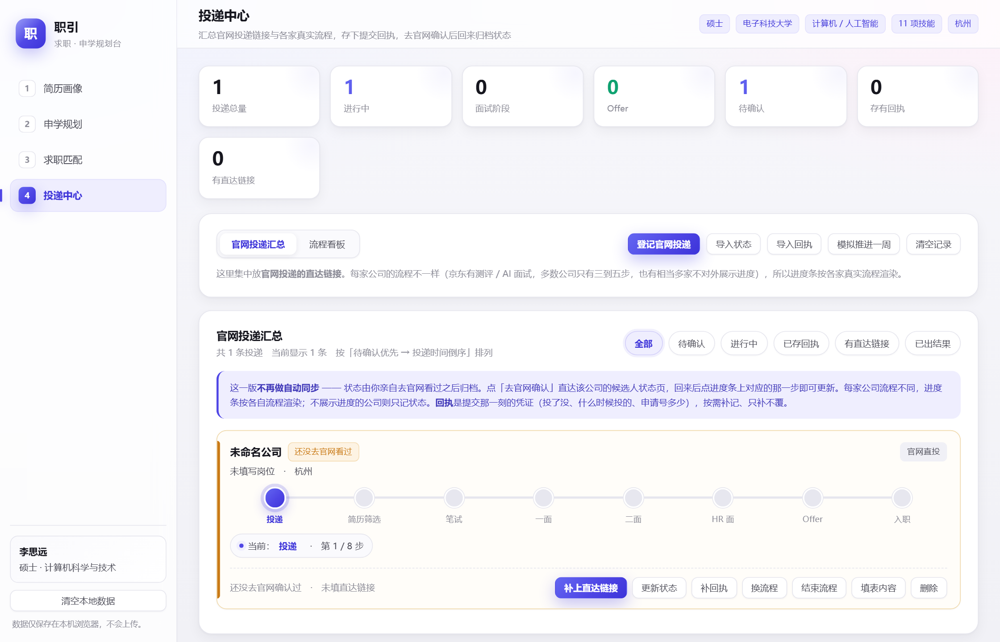
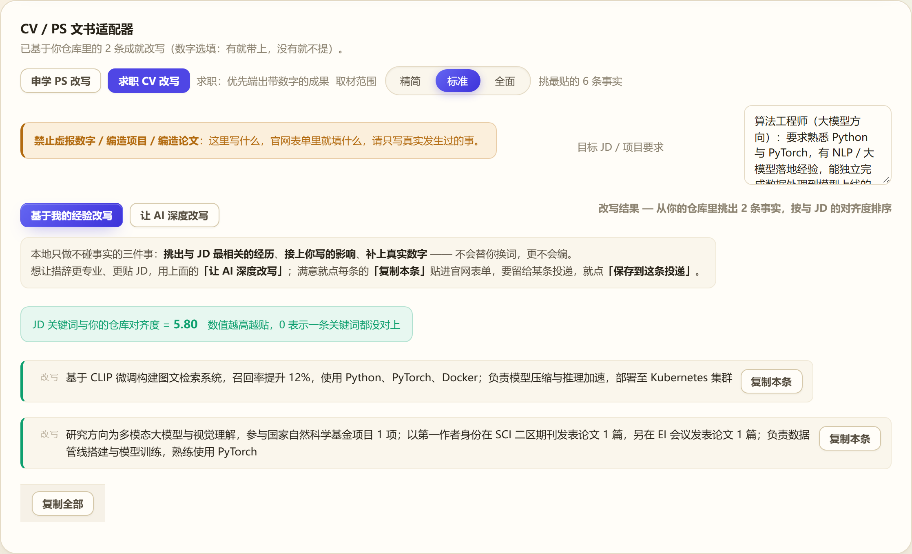
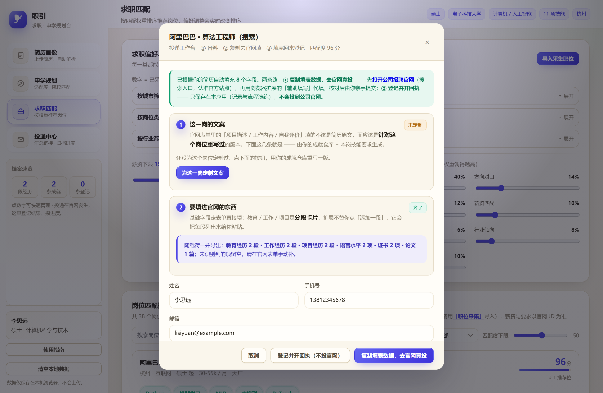
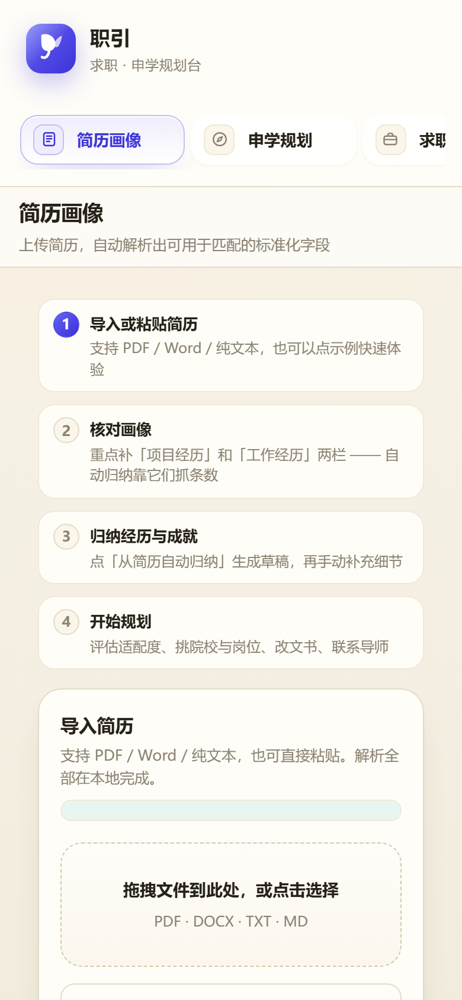

# 职引 · 求职与申学规划台

> 把简历、院校、岗位、投递进度和申请文书收进**同一条链路**的一站式规划工具。
> 单文件 HTML，零依赖、零后端、零密钥 —— 双击就能用。

[在线体验](https://hh67478618-hub.github.io/zhiyin/) · [界面预览](#界面预览) · [设计取舍](#几个刻意的取舍) · [快速开始](#快速开始)

<!-- 在线体验链接在仓库开启 GitHub Pages 后生效（Settings → Pages → 选 main 分支） -->

---

## 它解决什么问题

求职和申学这两件事，信息天生是散的：简历在 Word 里、院校要求在各校官网、岗位在招聘网站、
投递进度在备忘录、文书每投一家就要重写一遍。

「职引」不新增一个信息孤岛，而是把它们串成一条链：

```
简历 / 经历录入  →  经历仓库  →  双轨匹配（申学 · 求职）  →  投递管理  →  文书定制  →  官网表单自动填充  →  回执归档
```

链路上的每一步都读上游、写下游：你在简历里补了一条经历，它会同时出现在岗位匹配的依据、
投递包的定制材料、以及浏览器扩展要填进官网表单的字段里。

## 界面预览

| 简历画像 | 申学规划 |
|---|---|
|  |  |

| 求职匹配 | 投递中心 |
|---|---|
|  |  |

| 文书适配（改写前后对比） | 官网表单自动填充 |
|---|---|
|  |  |

<p align="center">
  
</p>

## 主要功能

**① 简历画像 —— 把简历变成可计算的结构**

上传或粘贴一份简历，自动拆出教育背景、实习、项目、技能、语言成绩等标准化字段；
再把每段经历拆成"可复用的成就条目"，沉淀为**经历仓库**。仓库是整条链路的事实来源。

**② 申学规划 —— 32 所院校 + 导师检索 + 套磁邮件**

按学位、地区、方向、预算筛选项目；用"冲 / 稳 / 保"三档给出可解释的判断（见下方取舍第 4 条）。
支持检索导师、按院校生成套磁邮件草稿（境外英文 / 内地中文两套写法）。

**③ 求职匹配 —— 七维加权，权重你自己调**

技能、方向对口、城市、薪资、学历、行业、经历七个维度打分。每个维度一个滑杆，
调完立刻重排 —— 想验证"如果通勤不重要会怎样"，拖一下就看到了。

**④ 投递管理 —— 每家公司一套流程**

不同公司的招聘流程不一样，所以流程模板是**一家一套**（含"没有进度条"这种档位）。
投递后可以开一张回执，之后的状态由你自己去官网确认、回来归档。

**⑤ 文书定制 —— 就地把材料改成这一家的形状**

针对某个具体岗位填充 JD，从经历仓库里挑出最贴的条目，生成可粘贴的填表数据，
并把成稿同步回这条投递的投递包。

**⑥ 浏览器扩展 —— 把材料填进真正的官网表单**

零依赖的 Chrome / Edge 扩展，识别应聘页面并自动填充已保存的字段，
逐字段汇报填上了什么、跳过了什么（证件号、密码一类一律跳过）。

## 几个刻意的取舍

这一节是这个项目里我花时间最多的地方。**做加法容易，知道哪里不该做加法难。**

**1. 只有"提交"那一刻是自动的。**
投递之后的状态变化，主流做法是自动抓取。但招聘网站千差万别、接口不对外，
覆盖不全的结果是**给出错误状态** —— 这比不给状态更糟，用户会据此做出错误判断。
所以这里改成：投递后开一张回执，之后由用户"去官网确认 → 回来归档"。

**2. 状态与回执分开存。**
状态会被反复改写；回执开出即定稿，只补不覆、不被状态污染。
两件东西的生命周期不同，就不该存在一个字段里。

**3. 不替用户编造事实。**
早期版本里做过"一键改写"：升级动词、嵌入岗位关键词。做出来才发现它把
"协助撰写文档"改成了"主导撰写文档" —— 这不是改写，是注水，面试一问就穿。
于是这个功能被下线，改成**提供素材与提示词**：工具负责把"你要改什么、你手上有什么"摆清楚，
表达本身交给用户（和用户自己的 AI）。**宁可功能少，也不制造经不起追问的简历。**

**4. 推荐结论必须可验证。**
院校"冲稳保"没有用达标率，而是用"自身综合竞争力 − 项目门槛的裕度"；
岗位匹配的七维权重也完全交给用户。原因是一样的：**当一个推荐会影响真实决策时，
用户必须能自己看出"它为什么这么排"**，否则无法判断该不该信。

**5. 识别不到就不猜。**
招聘系统的域名识别不到就留空；公司名、项目名认不出来的条目**整条丢弃**，不做模糊匹配。
少一条脏数据，比多一条看起来像对的脏数据好。

**6. 误操作的代价要低。**
"结束流程"需要二次确认，结束后按钮变"恢复流程"，一键回到原来的步骤；
时间轴只补不删 —— 撤回也要留痕。

## 技术说明

- **单文件**：全部功能在 `index.html` 里，约 7,000 行。无框架、无构建步骤、无外部依赖、无 CDN。
- **数据在本地**：简历、经历、投递记录都存在浏览器 `localStorage`，**不上传任何服务器** —— 本项目没有服务器。
- **算法在本地**：匹配、评分、排序全部在浏览器里跑，结果可解释、可复核，同一个输入永远得到同一个输出。
- **浏览器扩展**：`extension/` 目录，原生 JS + Manifest V3，同样零依赖。

## 快速开始

1. 下载 `index.html`
2. 双击打开（Chrome / Edge / Safari 均可）

不用装任何东西，不用注册，不用联网。

**关于 AI 部分：** 项目本身不内置大模型。在文书适配里点「让 AI 深度改写」，
会生成一段带好上下文的提示词，复制到你自己习惯的 AI 里跑完，把结果粘回来即可 ——
这样**页面里不需要保存任何 API 密钥**。

<details>
<summary>如果你希望一键调用大模型（可选）</summary>

可以在设置里填入自己的 API Key，请求直接从你的浏览器发往模型服务商，
**不经过任何中间服务器**，Key 只存在你自己的浏览器里。

已实测可通过浏览器直连的服务商：DeepSeek、Kimi、智谱 GLM、硅基流动、阿里百炼、
OpenRouter、Gemini；Claude 需附加一个请求头；OpenAI 当前的跨域策略会导致直连失败。

请在**你自己的设备**上使用这个功能。
</details>

<details>
<summary>浏览器扩展怎么装</summary>

1. 打开 `chrome://extensions`（Edge 是 `edge://extensions`）
2. 右上角打开「开发者模式」
3. 点「加载已解压的扩展程序」，选择本仓库的 `extension/` 目录

由于扩展需要读取当前页面来填表，浏览器会要求你确认权限；扩展不上传任何数据。
</details>

## 自动化测试

项目配有三套无头自测，合计 **802 项断言**，覆盖解析、评分、匹配、排序与界面交互。

其中核心算法层（**456 项**）**零依赖**，克隆下来就能跑：

```bash
node tests/engine.test.js
```

剩下两套（界面交互 96 项、扩展采集 250 项）需要 `jsdom`：

```bash
npm install
npm run test:all      # 跑全部三套
```

`tests/run-all.js` 会先做一次静态预检：**断言不能变成「`return` 之后的死代码」**。
这条检查是有来由的 —— 项目里真踩过：一个 `})());` 被插到了 50 行之外，
中间几条断言成了 IIFE 里 `return` 之后的死代码，语法合法、不报错、不计数、
输出里也看不到，整体照样打印「全部通过」。所以现在把它做成了机械判据，
而且**这个守卫自己也有测试**（坏样本必须命中、好样本必须不命中）。

## 关于开发方式

本项目的**产品设计、算法口径、验收标准**由作者定义；具体代码由 AI 编程助手实现，
作者逐条验收。为了确保"设计能被验证"，才有了上面那 802 项断言 ——
界面不会报错的算法问题，只能靠测试发现。

这个选择是刻意的：**当一个工具的推荐结果会影响用户的真实决策时，
"我能解释它为什么这么算"比"我知道它是怎么实现的"更重要。**

## 许可

[MIT](LICENSE) © 2026 [hh67478618-hub](https://github.com/hh67478618-hub)

---

**声明**：项目内置的院校与岗位信息为**结构真实的示例数据**（32 所院校 / 50 个岗位），
用于体验匹配逻辑，**非官方同步**，请以各院校和企业的官方信息为准。
